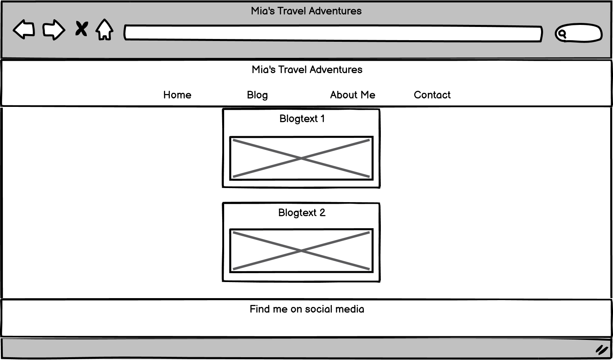

# Mia's Travel Adventures

Mia's travel adventures is a travel blog website of a fictitious blogger named Mia. It is targeted towards users who are interested in traveling and who would like to interact with the blogger and other users by leaving comments and liking posts. The user can find the blogposts of Mia as well as more information about the blogger and contact information. There is an option to create an account to be able to leave comments and like the posts.

For the blogger themselves an admin page is accessible after login, where the blogger can write posts and approve or delete comments.


## User Stories

- As a user I can see the homepage so that I know at first glance what the website is about.
- As a user I can find out more about the site owner so that I will gain some background information.
- As a user I can see contact information so that I can get in touch with the site owner.
- As a user I can see the blog posts so that I can read about the travel journey.
- As a user I can register for an account so that I can comment and like posts.
- As a user I can leave a comment to a post so that I can share my opinion and make travel suggestions.
- As a user I can edit my comment so that I have the possibility to update my comment.
- As a user I can delete my comment so that I am able to remove a comment I don´t want to be visible any longer.
- As a user I can like a post so that can show if I liked the content of the post.

- As a user/site owner I can see the comments so that I can read the conversation.
- As a user/site owner I can see the likes for each post so that I know which post is very popular.
- As a user/site owner I can see a message after I have left a comment/created a post on the frontend so that I know that the comment/post was successfully generated.

- As a site owner I can create, read and update my posts so that I can manage my travel blog appropriately.
- As a site owner I can create, update and delete my posts from the frontend so that I do not need use the admin tool.
- As a site owner I can create drafts so that I don't have to publish the post immediately and can finish it later.
- As a site owner I can approve or disapprove comments so that I can filter out questionable comments.
- As a site owner I can approve comments from the frontend so that I don't have to use the admin tool.

## UX
### Colour Scheme

As a first step the color extractor from [Adobe Color](https://color.adobe.com/create/image) has been used to extract colors from the chosen background image.


The light blue color #7EB6D9 from the homepage image has been used as the background color for the other pages. 

The light brown color #D9C6B0 was used as the background color for the header and footer as well as for the buttons on the website.

Black #000 was used as font color throughout the page as it contrasts well with the chosen background colors #7EB6D9 and #D9C6B0. This was tested in a contrast checker.

The darker blue color #446EA6 has been used as the background color for the hovered buttons in combination with white #fff as the font color. This contrast has been checked in a contrast checker as well.

### Typography 

Google Fonts has been used to find the font, that is displayed on the website. [Kalam](https://fonts.google.com/specimen/Kalam?category=Handwriting#glyphs) is a handwriting font family. As described on Google Fonts the fonts have been optimized for text usage on screen. The design feels very personal and the letters appear similar as the letters used in everyday handwriting. That is why is font has been chosen - the feeling of reading a personal travel journal should be conveyed to the reader. 

To provide visual cues icons from [Font Awesome](https://fontawesome.com/) have been used in the footer to point to the social  media websites. 

### Wireframes

Wireframes created with Balsamiq were used to plan the layout of the website.





## Features 

### Existing Features

- __Navigation Bar__

  - Featured on all pages the navigation bar includes links to the Homepage, Blog, About Me, Contact, Sign Up and Login. When logged in Logout is visible, while Sign Up and Login disappear. If the site owner/blogger is logged in there is a link to the frontend Admin page as well.
  - The navigation bar is fully responsive and identical on all pages to offer easy navigation.
  - It allows the user to easily navigate between the different pages across all devices, without having to use the “back” or “forward” buttons.
   - On small screen sizes the navbar will collapse into a toggler icon to keep the page well arranged.


- __Home Page__

  - The Home Page will allow the user to see the aim and purpose of the website.


- __Blog Page__

  - On the Blog Page the user can see the title of the blogposts as well as the creation/update date and the number of likes.
  - The site owner/blogger, when logged in, will additionally see their drafts and has the option to edit or delete their posts.
  - The title of each blogpost can be clicked to navigate to a detailed post view.


- __Post Detail with Comments__

  - On the post detail page the user has the possibility to read the post content and the comments of the other users.
  - When logged in:
    - the user can like/unlike the post
    - leave a comment (which will have to be approved by the site owner/blogger first)
    - edit or delete their own comments


- __About Me Page__

  - On the About Me Page the user can find out more information about the blogger and their reasons to start the travel blog.


- __Contact Page__

  - On the Contact Page the user can find different options on how to contact the blogger.


- __Sign Up Page__

  - The Sign Up Page allows the user to create an account.
  - The User will be asked to create a username and password, an email-address is optional.


- __Login Page__

  - The Login Page allows users, who already created an account, to login with their username and password.


- __Logout Page__

  - The Logout Page allows the user to logout.


- __Admin Page (Frontend)__

  - The Admin Page is only visible to the site owner/blogger, when logged in.
  - The blogger can create their posts/drafts.
  - The blogger can see new user comments and approve or delete them.
  - The blogger can delete already approved comments as well.


- __Footer__

  - The footer displays links to the social media sites of the blogger.
  - The user can click the respective icon to visit the social media website in a separate tab.


- __Admin Panel (Backend)__

  - The Admin Panel is only accessible to the site owner, when logged in.
  - As the main functionality of creating posts and approving comments is given on the frontend admin page, the backend admin panel should be used for maintenance only.
  - Nevertheless it is possible to create posts and approve comments from the backend admin panel as well.


- __Messages__

  - Messages are displayed at the top of the screen to notify the user when they have created/edited/deleted their comment and the site owner/blogger when they have created/edited/deleted their post and when they have approved the comment of a user.
  - This way the user/site owner will know when they have changed content.


### Features Left to Implement

- __Commenting on other users comments__

  - A feature that allows a user to leave a comment directly for the comment of another user and not just to the post in general. 
  - This would allow the site to become even more interactive.

- __Expanding the Frontend Admin Access__

  - A feature that allows to give access to the frontend admin panel in an easier way, by creating a new field in the model like
  ```python
    is_admin: models.BooleanField(default=False) 
  ```
  an using the following in the templates
  ```html
    
  ```
  - This would provide an easier way give to allow users admin access in case the blog expands.

## Database Models

 - The posts and comments app require databases to store information. Two models have been build.

 __Post Model__


 __Comments Model__

 

## Technologies Used

- HTML 
    - was used to structure the website semantically and display it in the browser.
- [Bootstrap](https://getbootstrap.com/) 
    - CSS framework used to build responsive design.
- CSS 
    - was used for additional presentation and style of the website.
- JavaScript 
    - was used to make the website interactive.
- [Python](https://www.python.org/) 
    - was used as programming language to write the code.
- [Django](https://www.djangoproject.com/)
    - framework has been used to build the project and the apps.
- [Django Crispy Forms](https://django-crispy-forms.readthedocs.io/en/latest/) 
    - is used to create the forms in the application.
- [TinyMCE](https://www.tiny.cloud/) 
    - is used as the text editor.
- [Gitpod](https://www.gitpod.io/) 
    - was used for the development of the website.
- [Github](https://github.com/) 
    - was used to store the code online.
- Git 
    - was used for version control.
- [The GitHub Projects Board](https://github.com/JulianeGampe/travel-blog/projects/1) 
    - was used to keep track of tasks that are still to do or in progress or see tasks that are already done.
- [The GitHub Issues tracker](https://github.com/JulianeGampe/travel-blog/issues) 
    - was used to keep track of bugs and add solutions.
- [Balsamiq](https://balsamiq.com/wireframes/) 
    - was used to create the wireframes.
- [Font Awesome](https://fontawesome.com/) 
    - was used for the icons.
- [Cloudinary](https://cloudinary.com/) 
    - is used to store and upload the images.
- [Heroku](https://www.heroku.com/home) 
    - is used to deploy the application
- [Google Fonts](https://fonts.google.com/)
    - was used for the website font
- [Adobe Color](https://color.adobe.com/create/image)
    - was used for extracting the colors from the homepage image and for color testing.


## Testing

Due to the length of testing, you can see all tests in the [TESTING.md](TESTING.md) file.

## Deployment

- The site was deployed....

The live link can be found here - 

### Local Deployment

If you would like to make a local copy of this repository, you can clone it by typing the following command in your IDE terminal:
- `git clone https://github.com/JulianeGampe/vocabulary-quiz.git`

Alternatively, if using Gitpod, you can click below to create your own workspace using this repository.

[](https://gitpod.io/#https://github.com/JulianeGampe/vocabulary-quiz)

## Credits 

### Content

- Code for .... has been taken from [w3schools](https://...)

### Media 

- The following websites were used to find the colors and do the contrast tests:
  - [Color Tool](https://material.io/resources/color/#!/?view.left=1&view.right=1&primary.color=201773)
  - [Adobe Color](https://color.adobe.com/create/color-contrast-analyzer)
- The font was found on [Google Fonts](https://fonts.google.com/)
  - [Cabin](https://fonts.google.com/specimen/Cabin?category=Sans+Serif&preview.text=Vocabulary%20Quiz&preview.text_type=custom#standard-styles)
- The icons in the quiz type buttons and footer were taken from [Font Awesome](https://fontawesome.com/)
  - [Animals Icon](https://fontawesome.com/v5.15/icons/paw?style=solid)
  - [Travel Icon](https://fontawesome.com/v5.15/icons/bus-alt?style=solid)
  - [Food Icon](https://fontawesome.com/v5.15/icons/utensils?style=solid)
  - [Instagram Icon](https://fontawesome.com/v5.15/icons/instagram?style=brands)
- [Balsamiq](https://balsamiq.com/wireframes/) was used to create the wireframes.
- [hatchful](https://hatchful.shopify.com/) was used for the favicon. 
- [Am I responsive](http://ami.responsivedesign.is/) has been used to create the responsive mockup of the project

### Acknowledgements

- I would like to thank...


Sources:

https://color.adobe.com/create/image


Help with Django blog/ function based view for comments

https://www.youtube.com/watch?v=m3hhLE1KR5Q
https://github.com/SteinOveHelset/codewithstein

Help with approval of comments
https://djangocentral.com/creating-comments-system-with-django/


Solution to make the name of the comments model the username:
https://stackoverflow.com/questions/65733442/in-django-how-to-add-username-to-a-model-automatically-when-the-form-is-submit

Help with confirmation of comment delete:
https://www.youtube.com/watch?v=3VBHWLFza4s

Help with {{ post.image.url }} cloudinary:
https://www.youtube.com/watch?v=1T6G7Znrbfg

Aboutme image
https://www.pexels.com/photo/a-woman-leaning-out-of-a-window-train-6761976/


Image as card background
https://www.tutorialspoint.com/Turn-an-image-into-a-Bootstrap-4-card-background


Text Center
https://mdbootstrap.com/docs/b4/jquery/utilities/horizontal-align/

Google Fonts
https://fonts.google.com/specimen/Kalam?category=Handwriting#glyphs

Upload cloudinary pictures from frontend:
https://jszczerbinski.medium.com/django-web-app-and-images-cloudinary-straightforward-study-ae8b5bb03e37

Using the tinymce widget in forms.py
https://django-tinymce.readthedocs.io/en/latest/usage.html#using-the-widget

Tinymce video
https://www.youtube.com/watch?v=l9VZlqCbiLk


messages video
https://www.youtube.com/watch?v=VIx3HD2gRWQ

messages timeout function and display
