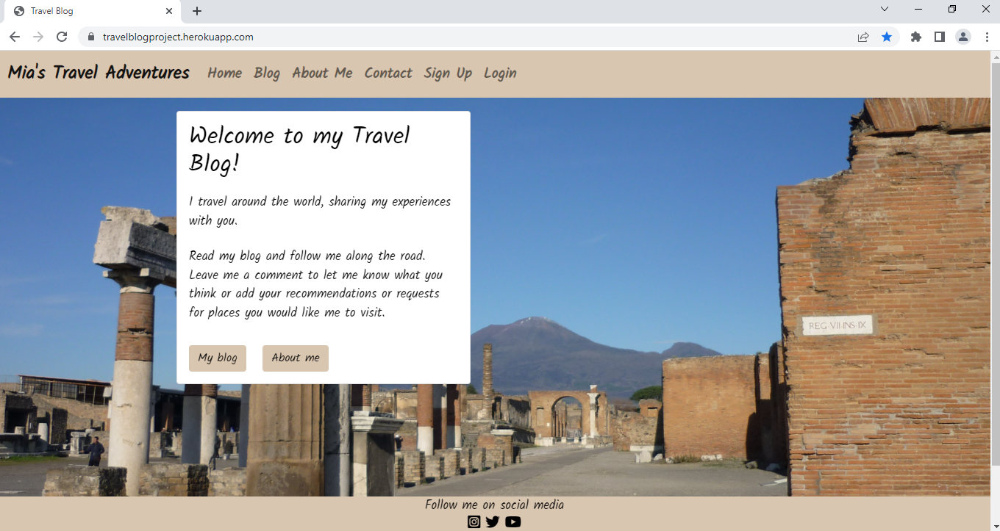

## Testing 

## Manual Testing

### Testing User Stories

- As a user I want ......
  

### Browser Compatibility

- The page has been tested and works in different browsers.
  - Google Chrome
    
    

  - Firefox
    
    
  
  - Microsoft Edge
    
    

### Responsiveness

- The project is responsive and functions on all standard screen sizes using the devtools device toolbar.

- The navigation, home page, ........ and the footer are readable and easy to understand.

  -  Google Chrome Desktop

    

  - Google Chrome Mobile

    

  - Firefox Desktop

    

  - Firefox Tablet

    
  
  - Microsoft Edge Desktop

    
  
  - Microsoft Edge Mobile

    

## Color Testing

- All colors have been tested with a contrast checker. 
  - Contrast test #201773 against #ffffff
  

## Validator Testing 

- PEP8
  - No errors were returned from [PEP8online.com](http://pep8online.com/).
    

- HTML
  - No errors were returned when passing through the official [W3C validator](https://validator.w3.org/)
    - [Home page](https://validator.w3.org/nu/.....)

      

- CSS
  - No errors were found when passing through the official [(Jigsaw) validator](https://jigsaw.w3.org/css-validator/validator?uri=https%3A%2F%2Fjulianegampe.github.io%2Fcat-sanctuary&profile=css3svg&usermedium=all&warning=1&vextwarning=&lang=en)

      

- JavaScript
  - No errors were found when passing through [JSHint](https://jshint.com/)

- Accessibility
  - The page passes the accessibility test using lighthouse in devtools

    

## Bugs
### Fixed Bugs

The following bugs were tracked and fixed using the GitHub Issues tracker with the label of "bug".

- **calculate points: >=500 points - play_new_round called anyway** - [#1](https://github.com/JulianeGampe/greedy-gremlin/issues/1)

### Remaining Bugs

- No remaining bugs that I am aware of.

---

Return to the [README](README.md) file