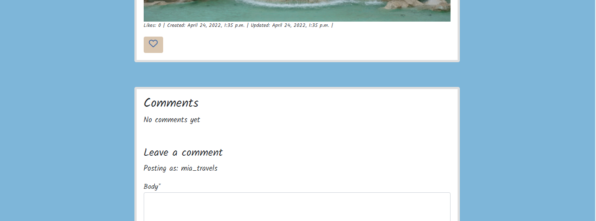

## Testing 

## Manual Testing

### Testing User Stories

The website funcionalty with all user stories have been tested manually while logged in as testusers, site owner/admin and while not logged in. Additional tests from the user perspective have been made by a friend who created a user account for themselves. 

1. As a user I can see the homepage so that I know at first glance what the website is about.
    
2. As a user I can find out more about the site owner so that I will gain some background information.
    
3. As a user I can see contact information so that I can get in touch with the site owner.
    
4. As a user I can see the blog posts so that I can read about the travel journey.
    
5. As a user I can register for an account so that I can comment and like posts.
    
    - The signup was tested with testaccounts.
    - It is not possible to sign up with missing or incorrect fields.
      
    - After sign up the user can login. All necessary fields have to be filled correctly.
        
    - When signed in the logout option appears and logout is possible.
      
6. As a user I can leave a comment to a post so that I can share my opinion and make travel suggestions.
    
    - Leaving comments was tested with testaccounts.
    - It is not possible to submit an empty comment.
    - The comment is not published immediately, but has to be approved by the admin first.
            
      
7. As a user I can edit my comment so that I have the possibility to update my comment.
    - Editing comments was tested with testaccounts.
    - It is not possible to edit comments of other users.
    - After editing the comment has to be approved by the admin before beeing published.
      
      
8. As a user I can delete my comment so that I am able to remove a comment I don´t want to be visible any longer.
    - Deleting comments was tested with testaccounts.
    - It is not possible to delete comments of other users.
      
       
9. As a user I can like a post so that can show if I liked the content of the post.
    - Liking posts was tested with testaccounts.
    - Liking a post is only possible when logged in.
      - Post Detail not logged in:
      
      - Post Detail logged in:     
         
10. As a user/site owner I can see the comments so that I can read the conversation.
    - All approved comments can be seen, even when not logged in.
    - Comments can not be edited or deleted when not logged in.
          
11. As a user/site owner I can see the likes for each post so that I know which post is very popular.
    - Likes can be seen when not logged in: On the blog page and on the blog details page.
    - Liking a post is only possible when logged in.
      - Main blog page:
       
      - Post Detail not logged in:
      
      - Post Detail logged in:     
        
12. As a user/site owner I can see a message after I have left a comment/created a post on the frontend so that I know that the comment/post was successfully generated.
      
      
13. As a site owner I can create, read and update my posts so that I can manage my travel blog appropriately.
    - Admin backend panel:
      
    - Creating, updating and deleting posts is also possible from the frontend, when logged in as admin.
    - The admin backend panel should therefore only be used for maintainance. 
14. As a site owner I can create, update and delete my posts from the frontend so that I do not need use the admin tool.
    - When logged in as admin the "admin" page is accessible.
      
    - Creating and updating posts has been tested with the admin account.
    - Posts can only be created with all necessary fields filled in and only with valid data.
      
      
    - When logged in as admin the edit and delete buttons are available for the posts and posts can be edited and deleted.
      
      
      
15. As a site owner I can create drafts so that I don't have to publish the post immediately and can finish it later.
    - When creating a post the status "draft" can be selected.
    - Drafts are appearing on the blog page, when the admin is logged in.
      
      
16. As a site owner I can approve or disapprove comments so that I can filter out questionable comments.
      
      - Approving and deleting comments is possible from the frontend admin page as well.
      - The admin backend panel should therefore only be used for maintainance.
17. As a site owner I can approve comments from the frontend so that I don't have to use the admin tool.
    - When logged in as admin the "admin" page is accessible.
      
    - User comments appear here. New comments can be approved or deleted.
    - Already approved comments can be seen as well, with the option to delete.
      

### Browser Compatibility

- The page has been tested and works in different browsers.
  - Google Chrome
    
    

  - Firefox
    
    
  
  - Microsoft Edge
    
    

### Responsiveness

- The project is responsive and functions on all standard screen sizes using the devtools device toolbar.

- The navigation, home page, ........ and the footer are readable and easy to understand.

  -  Google Chrome Desktop

    

  - Google Chrome Mobile

    

  - Firefox Desktop

    

  - Firefox Tablet

    
  
  - Microsoft Edge Desktop

    
  
  - Microsoft Edge Mobile

    

## Color Testing

- All colors have been tested with a contrast checker. 
  - Contrast test #201773 against #ffffff
  

## Validator Testing 

- PEP8
  - No errors were returned from [PEP8online.com](http://pep8online.com/).
    

- HTML
  - No errors were returned when passing through the official [W3C validator](https://validator.w3.org/)
    - [Home page](https://validator.w3.org/nu/.....)

      

- CSS
  - No errors were found when passing through the official [(Jigsaw) validator](https://jigsaw.w3.org/css-validator/validator?uri=https%3A%2F%2Fjulianegampe.github.io%2Fcat-sanctuary&profile=css3svg&usermedium=all&warning=1&vextwarning=&lang=en)

      

- JavaScript
  - No errors were found when passing through [JSHint](https://jshint.com/)

- Accessibility
  - The page passes the accessibility test using lighthouse in devtools

    

## Bugs
### Fixed Bugs

The following bugs were tracked and fixed using the GitHub Issues tracker with the label of "bug".

- **calculate points: >=500 points - play_new_round called anyway** - [#1](https://github.com/JulianeGampe/greedy-gremlin/issues/1)

### Remaining Bugs

- No remaining bugs that I am aware of.

---

Return to the [README](README.md) file